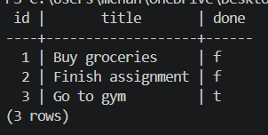

# Task API (Containerized)

A full CRUD REST API for managing a to-do list, built with Node.js and Express, backed by a real PostgreSQL database, and containerized using Docker.

## What this is

This backend API supports full CRUD (Create, Read, Update, Delete) operations. Storage has moved through three stages in this repo: in-memory (A1), SQLite (A2), and now a containerized PostgreSQL database (A3). The entire stack (app + database) is networked via Docker Compose and runs on any machine with a single command.

## How to run it

1. Clone this repo
2. Set up environment variables

   Create your local `.env` file from the provided example to safely load the database connection string:

   On Mac/Linux:

cp .env.example .env

   On Windows CMD/PowerShell:

copy .env.example .env

3. Start the stack

   Build and start the Node application and the Postgres database together:

docker compose up

   The API will be available at `http://localhost:3000`.

## Endpoints

| Method | Path | Description |
|--------|------|-------------|
| GET | / | API info |
| GET | /health | Health check |
| GET | /tasks | List all tasks |
| GET | /tasks/:id | Get a single task |
| POST | /tasks | Create a new task (requires JSON body) |
| PUT | /tasks/:id | Update a task title or status |
| DELETE | /tasks/:id | Delete a task |

## Example request

Request:

curl.exe -i -X POST http://localhost:3000/tasks -H "Content-Type: application/json" -d "@test.json"

Response:

HTTP/1.1 201 Created
X-Powered-By: Express
Content-Type: application/json; charset=utf-8
Content-Length: 40
Date: Mon, 20 Jul 2026 17:10:10 GMT

{"id":4,"title":"Buy milk","done":false}

## Data persistence (the mortality test)

Data is fully persistent. The PostgreSQL database runs in a Docker container and uses a Docker volume (`taskdata`) to save rows directly to the host disk.

Creating a task, stopping the server, tearing down the stack with `docker compose down`, and bringing it back online with `docker compose up` proves that the data survives the restart.

## Repository pattern

All database logic lives in `db.js`, kept completely separate from the routes in `index.js`. This is the third storage engine this same API has run on (memory in A1, SQLite in A2, Postgres here in A3), and the routes and request/response shapes never changed across any of the three swaps, only the repository module did.

## Swagger UI

Interactive API docs are available at `http://localhost:3000/docs` once the server is running.

## Database verification

## Tech stack

Node.js, Express, pg (node-postgres), PostgreSQL 15, Docker, Docker Compose, Swagger UI (swagger-ui-express)
