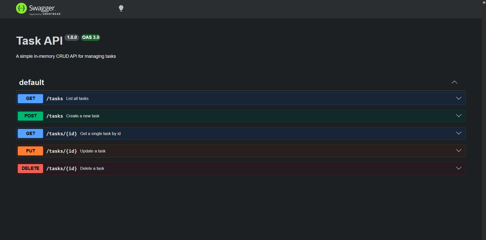

# Task API

A simple in-memory CRUD API for managing a to-do list, built with Node.js and Express.

## What this is

A backend API with five endpoints supporting full CRUD (Create, Read, Update, Delete) operations on an in-memory list of tasks. No database, data resets when the server restarts (see note below).

## How to run it

1. **Clone this repo**
2. **Install dependencies**
  ```bash
  npm install
  ```
3. **Start the server**
  ```bash
  node index.js
  ```

The server will run at `http://localhost:3000`.

## Endpoints

| Method | Path | Description |
| --- | --- | --- |
| **GET** | `/` | API info |
| **GET** | `/health` | Health check |
| **GET** | `/tasks` | List all tasks |
| **GET** | `/tasks/:id` | Get a single task |
| **POST** | `/tasks` | Create a new task |
| **PUT** | `/tasks/:id` | Update a task |
| **DELETE** | `/tasks/:id` | Delete a task |

## Example request

**Request:**

```bash
curl -i -X POST http://localhost:3000/tasks \
  -H "Content-Type: application/json" \
  -d '{"title":"Buy milk"}'
```

**Response:**

```http
HTTP/1.1 201 Created
Content-Type: application/json

{
  "id": 4,
  "title": "Buy milk",
  "done": false
}
```

## Swagger UI

Interactive API docs are available at `http://localhost:3000/docs` once the server is running.



## Data persistence note

> **Tasks are stored in memory only.** Restarting the server resets the task list back to the 3 default tasks, this is expected behavior, not a bug. A database will be added in a later stage of this track to make data persistent across restarts.
