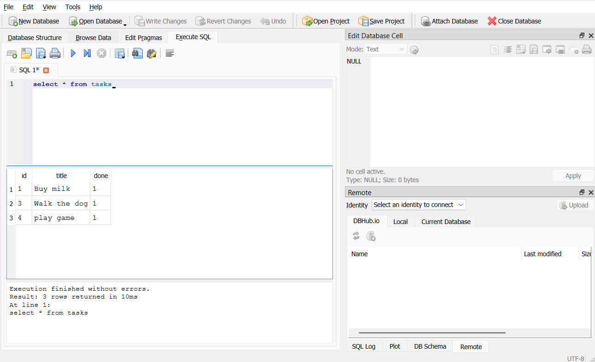

# Task API (SQLite)

A full CRUD REST API for managing a to-do list, built with Node.js and Express, backed by a SQLite database.

## What this is

This backend API supports full CRUD (Create, Read, Update, Delete) operations. Originally built in-memory (data lost on every restart), storage has been swapped to a SQLite database file (`tasks.db`). The API endpoints behave identically to the in-memory version, but data now survives server restarts.

## Why SQLite

SQLite was chosen because it requires no separate database server, no installation, and no configuration. The entire database is a single file that gets created automatically the first time the app runs, making it ideal for a small project like this where the priority is learning persistence, not running production infrastructure.

## Where the database lives

The database is stored in a file called `tasks.db` in the project root. This file is created automatically on first run and is git-ignored, so each fresh clone starts with a clean database that gets seeded with 3 example tasks on first startup.

## How to run it

1. Clone this repo
2. Install dependencies:

npm install

3. Start the server:

node index.js

4. Server runs at `http://localhost:3000`

The database file and table are created automatically. Three example tasks are seeded only on the very first run.

## Endpoints

| Method | Path | Description |
|--------|------|-------------|
| GET | / | API info |
| GET | /health | Health check |
| GET | /tasks | List all tasks |
| GET | /tasks/:id | Get a single task |
| POST | /tasks | Create a new task |
| PUT | /tasks/:id | Update a task |
| DELETE | /tasks/:id | Delete a task |

## Example request

curl.exe -i -X POST http://localhost:3000/tasks -H "Content-Type: application/json" -d "@test.json"

HTTP/1.1 201 Created
Content-Type: application/json

{"id":4,"title":"Buy milk","done":0}


## Data persistence

Unlike the original in-memory version, data is now persistent. Tasks are stored in a SQLite file (`tasks.db`) instead of a JavaScript array. Creating tasks, restarting the server, and running `GET /tasks` again confirms the tasks are still there, the first time this API's data has survived a restart.

## Exploring the database directly

Stage 4 of this assignment involved running raw SQL directly against the database using DB Browser for SQLite and comparing it against the live API. One query run:

```sql
UPDATE tasks SET done = 1;
```

This marked every task as done. Running `GET /tasks` immediately afterward, with no server restart, reflected the same change, confirming the API and the database file share one source of truth.

**Note:** DB Browser for SQLite holds a lock on the database file while open, which caused a `SQLITE_BUSY` error when the running server tried to write to the file at the same time. Closing DB Browser resolved this. Worth knowing if using DB Browser and the running app together.



## Swagger UI

Interactive API docs are available at `http://localhost:3000/docs` once the server is running.


## Tech stack

Node.js, Express, sqlite3, Swagger UI (swagger-ui-express)